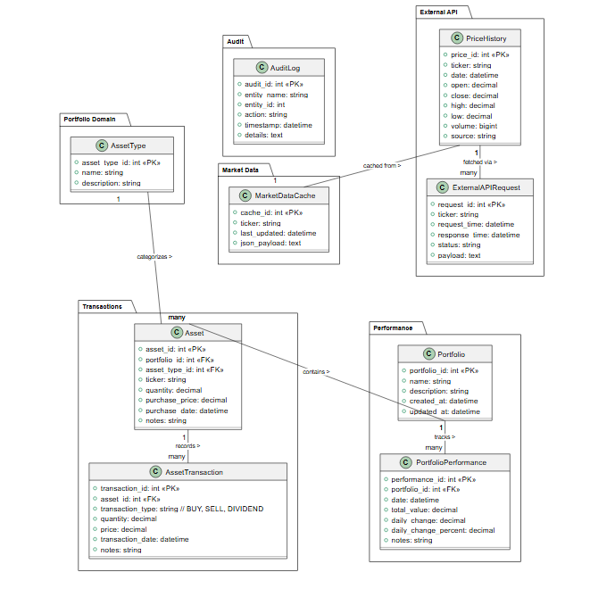

# Portfolio Manager

Intelligent Local Investment Platform

A full-stack, local-only, ML-powered portfolio management system built with **FastAPI**, **MySQL**, **Yahoo Finance**, **Machine Learning**, **Recommender Systems**, **CSV Import/Export**, and a **Dashboard UI**.

This project runs entirely on localhost — no cloud, no external hosting.

---

## Table of Contents

- [Overview](#overview)
- [Architecture](#architecture)
- [ERD](#erd)
- [Features](#features)
- [Tech Stack](#tech-stack)
- [Project Structure](#project-structure)
- [Installation](#installation)
- [Environment Variables](#environment-variables)
- [Running the Application](#running-the-application)
- [API Endpoints](#api-endpoints)
- [User Authentication](#user-authentication)
- [CSV Import/Export](#csv-importexport)
- [Machine Learning Models](#machine-learning-models)
- [Recommender System](#recommender-system)
- [Dashboard UI](#dashboard-ui)
- [Automation](#automation)
- [Risk & Analytics](#risk--analytics)
- [Portfolio Optimization](#portfolio-optimization)
- [Logging & Monitoring](#logging--monitoring)
- [Future Enhancements](#future-enhancements)
- [License](#license)

---

## Overview

The **Portfolio Manager** is a complete local backend + ML + analytics platform for managing financial portfolios, tracking assets, ingesting market data, computing performance, and generating intelligent insights.

It includes:

- FastAPI backend
- MySQL database
- Live Yahoo Finance integration
- ML prediction models
- Recommender systems
- Risk analytics
- Dashboard visualization
- CSV import/export
- Daily automation
- Audit logging
- Market data caching

---

## Architecture

### Backend

FastAPI modular service-based architecture.

### Database

MySQL relational schema based on the ERD below.

### Market Data

Yahoo Finance (`yfinance`) for live + historical data.

### ML Layer

Local Python ML models for prediction & risk analytics.

### Recommender Engine

Local content-based + collaborative filtering.

### Dashboard

Local React/Vue frontend with charts & insights.

### Automation

Local scheduler (APScheduler or cron).

### CSV Import/Export

Local file-based ingestion and export.

---

## ERD



### Core Entities

- portfolio
- asset
- portfolio_item
- transaction
- price_history

### Extended Entities

- asset_type
- asset_transaction
- portfolio_performance
- market_data_cache
- external_api_request
- audit_log

### Authentication Entities

- user
- user_role
- user_session

All entities are implemented in the backend.

---

## Features

- Portfolio CRUD
- Asset CRUD
- Portfolio Item Management
- BUY/SELL/DIVIDEND Transactions
- Historical Price Ingestion (Yahoo Finance)
- Market Data Caching
- External API Logging
- Audit Logging
- Portfolio Performance Tracking
- User Authentication (JWT)
- Role-Based Access Control
- CSV Import/Export
- ML Price Prediction
- Asset Recommendation Engine
- Risk Modeling
- Efficient Frontier Optimization
- Dashboard Visualization
- Daily Automated Ingestion

---

## Tech Stack

| Component        | Technology                          |
| ---------------- | ----------------------------------- |
| Backend          | FastAPI                             |
| Database         | MySQL                               |
| Market Data      | Yahoo Finance (yfinance)            |
| ML Models        | TensorFlow / Prophet / Scikit-Learn |
| Recommender      | Scikit-Learn                        |
| Dashboard        | React / Vue / Chart.js / Plotly     |
| Automation       | APScheduler / Cron                  |
| Logging          | Custom audit + API logs             |

---

## Project Structure

```
.
├── portfolio_manager/
│   ├── app/
│   │   ├── main.py
│   │   ├── config.py
│   │   │
│   │   ├── routes/
│   │   │   ├── auth_routes.py
│   │   │   ├── portfolio_routes.py
│   │   │   ├── asset_routes.py
│   │   │   ├── price_routes.py
│   │   │   ├── transaction_routes.py
│   │   │   ├── asset_type_routes.py
│   │   │   ├── asset_transaction_routes.py
│   │   │   ├── performance_routes.py
│   │   │   ├── csv_routes.py
│   │   │   ├── ml_routes.py
│   │   │   ├── recommender_routes.py
│   │   │   ├── risk_routes.py
│   │   │   ├── optimization_routes.py
│   │   │   └── scalar_ui.py
│   │   │
│   │   ├── services/
│   │   │   ├── auth_service.py
│   │   │   ├── portfolio_service.py
│   │   │   ├── asset_service.py
│   │   │   ├── price_service.py
│   │   │   ├── transaction_service.py
│   │   │   ├── asset_type_service.py
│   │   │   ├── asset_transaction_service.py
│   │   │   ├── portfolio_performance_service.py
│   │   │   ├── market_cache_service.py
│   │   │   ├── api_logging_service.py
│   │   │   ├── audit_service.py
│   │   │   ├── csv_service.py
│   │   │   ├── ml_service.py
│   │   │   ├── ml_service_enhanced.py
│   │   │   ├── recommender_service.py
│   │   │   ├── risk_service.py
│   │   │   ├── optimization_service.py
│   │   │   ├── data_provider.py
│   │   │   └── portfolio_service.py
│   │   │
│   │   ├── database/
│   │   │   ├── connection.py
│   │   │   ├── models.py
│   │   │   ├── schemas.py
│   │   │   └── __init__.py
│   │   │
│   │   ├── ingestion/
│   │   │   ├── fetch_assets.py
│   │   │   ├── fetch_prices.py
│   │   │   └── __init__.py
│   │   │
│   │   ├── tests/
│   │   │   ├── test_assets.py
│   │   │   ├── test_portfolio.py
│   │   │   ├── test_prices.py
│   │   │   └── __init__.py
│   │   │
│   │   └── utils/
│   │       ├── logger.py
│   │       ├── exceptions.py
│   │       └── __init__.py
│   │
│   ├── scripts/
│   │   ├── daily_ingestion.py
│   │   ├── export_csv.py
│   │   ├── import_csv.py
│   │   ├── init_db.sql
│   │   └── seed_data.py
│   │
│   ├── .env
│   ├── .gitignore
│   ├── requirements.txt
│   ├── README.md
│   ├── flowchart.PNG
│   ├── IMPLEMENTATION_SUMMARY.md
│   ├── LSTM_QUICKSTART.md
│   ├── LSTM_TUNING.md
│   ├── ML_ENHANCEMENTS.md
│   ├── populate_prices.py
│   ├── QUICK_REFERENCE.md
│   └── test_lstm_prediction.py
│
├── ERD_Portfolio_mgmt_system.PNG
└── README.md
```

---

## Installation

### Prerequisites

- Python 3.10+
- MySQL 8.0+
- pip

### Setup

```bash
# Clone the repository
git clone <repository-url>
cd vector3_ms

# Create a virtual environment
python -m venv venv

# Activate the virtual environment
# Windows:
venv\Scripts\activate
# macOS/Linux:
source venv/bin/activate

# Install dependencies
cd portfolio_manager
pip install -r requirements.txt
```

---

## Environment Variables

Create a `.env` file in the `portfolio_manager/` directory:

```
DB_HOST=localhost
DB_USER=root
DB_PASS=yourpassword
DB_NAME=portfolio_manager

JWT_SECRET=your_secret_key
JWT_ALGORITHM=HS256
JWT_EXPIRATION_HOURS=24

ALPHA_VANTAGE_API_KEY=your_alpha_vantage_key
FINNHUB_API_KEY=your_finnhub_key
```

---

## Running the Application

```bash
cd portfolio_manager
uvicorn app.main:app --reload
```

API available at:

- `http://localhost:8000`
- `/docs` — Swagger UI
- `/redoc` — ReDoc
- `/scalar` — Scalar API Console

---

## API Endpoints

### Portfolios

- `GET /portfolios/`
- `POST /portfolios/`

### Assets

- `GET /assets/`
- `GET /assets/{ticker}`
- `POST /assets/{ticker}`

### Prices (Yahoo Finance + DB)

- `GET /prices/{ticker}`
- `POST /prices/{ticker}`

### Transactions

- `GET /transactions/{portfolio_id}`
- `POST /transactions/{portfolio_id}`

### Asset Types

- `GET /asset-types/`
- `POST /asset-types/`

### Asset Transactions

- `GET /asset-transactions/{asset_id}`
- `POST /asset-transactions/{asset_id}`

### Portfolio Performance

- `GET /performance/{portfolio_id}`
- `POST /performance/{portfolio_id}`

### CSV

- `POST /csv/import/{type}`
- `GET /csv/export/{type}`

### Auth

- `POST /auth/register`
- `POST /auth/login`
- `GET /auth/me`

---

## User Authentication

- Local users stored in MySQL
- Password hashing via bcrypt
- JWT tokens for login
- Role-based access control
- Portfolio ownership enforced

---

## CSV Import/Export

### Import CSV

Supports:

- assets
- transactions
- price history
- portfolio items

### Export CSV

Supports:

- holdings
- transactions
- price history
- performance

---

## Machine Learning Models

### Price Prediction

- LSTM
- GRU
- Prophet
- ARIMA

### Risk Prediction

- VaR
- volatility
- drawdown

### Asset Classification

- growth
- value
- dividend
- high-risk

### Portfolio Health Score

- diversification
- volatility
- sector exposure

---

## Recommender System

### Content-Based Filtering

Based on:

- sector
- industry
- volatility
- market cap

### Collaborative Filtering

Based on:

- similar users
- similar portfolios

### Diversification Engine

Suggests assets to reduce risk.

---

## Dashboard UI

Local dashboard built with:

- React or Vue
- Chart.js
- Plotly

Shows:

- price charts
- portfolio performance
- asset allocation
- ML predictions
- recommendations
- risk analytics

---

## Automation

### Daily Price Ingestion

Fetches OHLCV via Yahoo Finance.

### Daily Portfolio Valuation

Computes:

- total value
- daily change
- daily % change

### Daily Risk Metrics

Updates:

- volatility
- beta
- Sharpe ratio

---

## Risk & Analytics

Includes:

- Sharpe Ratio
- Beta
- Volatility
- VaR
- Correlation Matrix
- Covariance Matrix
- Drawdown Analysis

---

## Portfolio Optimization

- Efficient Frontier
- Modern Portfolio Theory (MPT)
- Monte Carlo Simulation
- Optimal Asset Allocation
- Risk Parity

---

## Logging & Monitoring

### Audit Log

Tracks:

- entity changes
- updates
- deletes

### External API Request Log

Tracks:

- request time
- response time
- status

### Market Data Cache

Stores raw JSON from Yahoo Finance.

---

## Future Enhancements

- Strategy backtesting
- PDF portfolio reports
- Local websocket price streaming
- Custom strategy plugins
- Multi-user collaboration

---

Two processes. Backend on port 8000, frontend (Vite/React) on port 3000, proxying /api to the backend.
1. Backend (from portfolio_manager/):
venv\Scripts\activate
uvicorn app.main:app --reload
FastAPI runs at http://localhost:8000 (/docs, /scalar).
2. Frontend (from portfolio_manager/ui/):
npm install
npm run dev
UI runs at http://localhost:3000, and /api/* calls get forwarded to the backend on 8000.
Note: this requires MySQL running and .env configured first.

## License

This project is licensed under the MIT License.